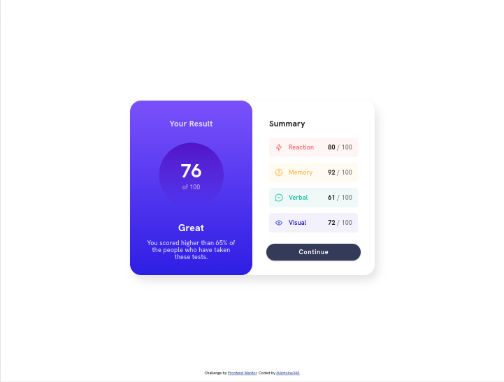

# Frontend Mentor - Results summary component solution

This is a solution to the [Results summary component challenge on Frontend Mentor](https://www.frontendmentor.io/challenges/results-summary-component-CE_K6s0maV). Frontend Mentor challenges help you improve your coding skills by building realistic projects.

## Table of contents

- [Overview](#overview)
   - [The challenge](#the-challenge)
   - [Screenshot](#screenshot)
   - [Links](#links)
- [Built with](#built-with)

## Overview

### The challenge

### Links

- Solution URL: [Add solution URL here](https://effortless-gelato-738bfe.netlify.app/)

## Built with

- Vue 3
- Vite
- Vuetify 3
- TypeScript
- SASS

## Author

- Website - [Add your name here](https://www.your-site.com)
- Frontend Mentor - [@yourusername](https://www.frontendmentor.io/profile/yourusername)
- Twitter - [@yourusername](https://www.twitter.com/yourusername)
